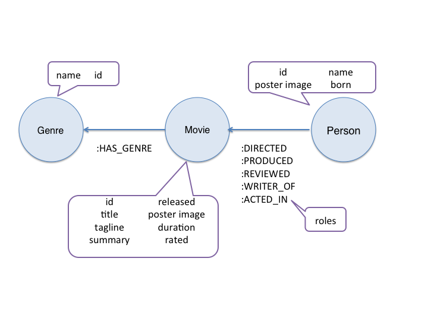
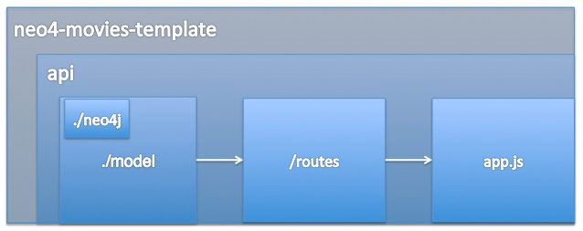

Movie App Tutorial
======

# General Introduction

This tutorial walks through the creation of a complete web application, [Neo4j Movies](http://neo4jmovies.herokuapp.com/#/movies), a Neo4j-Swagger-AngularJS version of Cineasts.net, a social movie database where users can connect with friends, rate movies, share scores, and generate recommendations for new friends and movies.

This tutorial takes the reader through the steps necessary to create the application, explaining each step of the stack on the way. The complete source code for the app is available on [GitHub](https://github.com/kbastani/neo4j-movies-template), and resources and references are available at the end of the document. 

# The Stack: An Overview

## Neo4j

Written in Java since YEAR, [Neo4j](http://neo4j.org/)is a scalable, a fully transactional database (ACID) that stores data structured as graphs. Designed to be intuitive, high performance and scalable, it has a disk-based, native storage manager optimized for storing graph structures with maximum performance and scalability. Neo4j can handle graphs with many billions of nodes/relationships/properties on a single machine, but can also be scaled out across multiple machines for high availability.

## Swagger

Developed by Wordnik, Swagger™ defines a standard, language-agnostic interface to REST APIs which allows both humans and computers to discover and understand the capabilities of the service without access to source code, documentation, or through network traffic inspection. When properly defined via Swagger, a consumer can understand and interact with the remote service with a minimal amount of implementation logic.

## AngularJS

_What HTML should have been_, AngularJS is an open-source web application framework, assists in the creation of web applications that only require HTML, CSS, and JavaScript on the client side. Its goal is to augment web applications with model–view–controller (MVC) capability, in an effort to make both development and testing easier. AngularJS' two-way data binding is its most notable feature and reduces the amount of code written by relieving the server backend of templating responsibilities. Instead, templates are rendered in plain HTML according to data contained in a scope defined in the model.

# The Domain Model

## Neo4j: Background

The Neo4j data model consists of nodes and relationships, both of which can have key/value-style properties. What does that mean, exactly? Nodes are the graph database name for records, with property keys instead of column names. That's normal enough. Relationships are the special part. In Neo4j, relationships are first-class citizens. More than a simple foreign-key reference to another record, relationships carry information, allowing us to link nodes into semantically rich networks.

## The Movie Database Model

The model in this tutorial includes three different types of nodes, each with their own properties, and six different types of relationships, one of which has its own properties. The underlying structure of the web application is described in the image below:



The Swagger API, which lies between the AngularJS web application and the Neo4j database, exports a relevant subset of the above model like so.

You can see the Swagger API in action [here](http://movieapi-neo4j.herokuapp.com/docs/).


# Neo4j: Setting up the Database

## Neo4j: Getting it Running

- If you haven't done so already, download Neo4jhere
- Extract Neo4j to a convenient location and rename the folder to something less cumbersome, like 'Neo4j', if you want
- Navigate to the extracted folder and run `./bin/neo4j start`
- If all goes well, you should see the Neo4j web application running at [port 7474](http://localhost:7474/)


An empty database is not much fun. Let's put some sample data in to see Neo4j in action:

- Navigate to your Neo4j directory
- If you have Neo4j running, stop it with `./bin/neo4j stop` in the Neo4j directory
- If you want to make sure you killed it good, check by running `launchctl list | grep neo` and `launchctl remove` any processes that might be listed
- If youls data, you'll see a file called `graph.db`.
- Delete the existing `graph.db`.
- Grab the zipped movies graph database file from the `databases` folder in the web app repository
- Unzip it into thedatafolder
- Run Neo4j! You should be able to see some nodes at [port 7474](http://localhost:7474/)

## Cypher: An Introduction 

Get started with Cypher on the Neo4j [Learn Cypher](http://www.neo4j.org/learn/cypher) page.

Don't know how much to put in this section.

## Building the Database

Although the tutorial repository comes with a pre-built graph.db file, you'll need to be able to create your own graph.db file with your own data. This section will demonstrate how to re-create the existing graph.db file on your local Neo4j instance. Although there are multiple ways to create a graph.db from scratch, this tutorial will use the Cypher command LOAD CSV. 

### Getting Ready

- Stop Neo4j and move the existing `graph.db` file out of the `data` folder in your instance of Neo4j. When you restart Neo4j, it will detect the absence of this file and generate a blank one. 
- Prepare and organize your data into CSV files. Take a look at the `csv` folder in this repository for the files used to build the movie database. 
	- Each node should have a unique ID
	- Each node type should have its own file. In this example, there are three node types, Genre, Person and Movie, and their data are in `genre_nodes.csv`, `person_nodes.csv` and `movie_nodes.csv`, respectively. 
	- Each relationship type should have its own file. In this example, there are seven relationship types, each represented in their own .csv file
	- Delimiters should not appear in the raw data. Unlike the comma or any other commonly-used punctiation mark, the pipe `|` is a decent choice for delimiter as it is unlikely to appear in the raw data, and a quick search reveals it does not appear in the data. 
	- Headers should be unique within files. As `LOAD CSV` (in this example) uses headers, make sure that each column in a file has a unique header. 
	
### Using LOAD CSV

Data ready, let's fill up the database. Although there are a few methods to get large amounts of data into a Neo4j database, in this tutorial we'll be using LOAD CSV. If you're rusty on Cypher, take a look at [this Graph Gist](http://gist.neo4j.org/?github-whatSocks%2FGG_Movies%2F%2FmoviesGG.adoc) to see LOAD CSV in action before you start. 

Since this tutorial assumes you're running Neo4j locally, you'll csv path will look something like `file:/` + `path from root to csv file` + `filename.csv`.

Start up Neo4j and head over to `http://localhost:7474/browser/`, or start the [Neo4j shell](http://docs.neo4j.org/chunked/stable/shell-starting.html). Note that although the shell requires semicolons, they are optional in the web console. 

Make sure you're pointing at the correct location with a test query (but write your own path in).  

```
LOAD CSV WITH HEADERS
FROM "file:/Users/cristina/Documents/NT/neo4j-movies-template/csv/nodes/genre_nodes.csv" 
AS line 
FIELDTERMINATOR '|' 
WITH line LIMIT 4
RETURN line;
```
Once you've played around a bit and are sure you know where you're pointing, clear the database of any test data and start importing your data. 

```
//Clear the database of any remnants of test data:
MATCH (n)
WITH n LIMIT 10000
OPTIONAL MATCH (n)-[r]->()
DELETE n,r;
```

#### Import your Nodes

```
LOAD CSV WITH HEADERS
FROM "file:/Users/cristina/Documents/NT/neo4j-movies-template/csv/nodes/genre_nodes.csv" 
AS line 
FIELDTERMINATOR '|'
WITH line
CREATE (g:Genre {id:toInt(line.id), name:line.name});
```

```
LOAD CSV WITH HEADERS
FROM "file:/Users/cristina/Documents/NT/neo4j-movies-template/csv/nodes/person_nodes.csv" 
AS line 
FIELDTERMINATOR '|'
CREATE (p:Person {id:toInt(line.id), name:line.name, poster_image:line.poster_image, born:toInt(line.born)});
```

```
LOAD CSV WITH HEADERS
FROM "file:/Users/cristina/Documents/NT/neo4j-movies-template/csv/nodes/movie_nodes.csv" 
AS line 
FIELDTERMINATOR '|'
CREATE (m:Movie {id:toInt(line.id), title:line.title, poster_image:line.poster_image, born:line.born, tagline:line.tagline, summary:line.summary, released:toInt(line.released), duration:toInt(line.duration), rated:line.rated});
```

#### Import your Relationships:

```
LOAD CSV WITH HEADERS
FROM "file:/Users/cristina/Documents/NT/neo4j-movies-template/csv/rels/acted_in_rels.csv" 
AS line 
FIELDTERMINATOR '|'
MATCH (p:Person {id:toInt(line.person_id)}), (m:Movie {id:toInt(line.movie_id)})
MERGE (p)-[:ACTED_IN {role:line.roles}]->(m);
```

```
LOAD CSV WITH HEADERS
FROM "file:/Users/cristina/Documents/NT/neo4j-movies-template/csv/rels/directed_rels.csv" 
AS line 
FIELDTERMINATOR '|'
MATCH (p:Person {id:toInt(line.person_id)}), (m:Movie {id:toInt(line.movie_id)})
MERGE (p)-[:DIRECTED]->(m);
```

```
LOAD CSV WITH HEADERS
FROM "file:/Users/cristina/Documents/NT/neo4j-movies-template/csv/rels/has_genre_rels.csv" 
AS line 
FIELDTERMINATOR '|'
MATCH (m:Movie {id:toInt(line.movie_id)}), (g:Genre{id:toInt(line.genre_id)})
MERGE (m)-[:HAS_GENRE]->(g);
```

```
LOAD CSV WITH HEADERS
FROM "file:/Users/cristina/Documents/NT/neo4j-movies-template/csv/rels/produced_rels.csv" 
AS line 
FIELDTERMINATOR '|'
MATCH (p:Person {id:toInt(line.person_id)}), (m:Movie {id:toInt(line.movie_id)})
MERGE (p)-[:PRODUCED]->(m);
```

```
LOAD CSV WITH HEADERS
FROM "file:/Users/cristina/Documents/NT/neo4j-movies-template/csv/rels/reviewed_rels.csv" 
AS line 
FIELDTERMINATOR '|'
MATCH (p:Person {id:toInt(line.person_id)}), (m:Movie {id:toInt(line.movie_id)})
MERGE (p)-[:REVIEWED]->(m);
```
```
LOAD CSV WITH HEADERS
FROM "file:/Users/cristina/Documents/NT/neo4j-movies-template/csv/rels/writer_of_rels.csv" 
AS line 
FIELDTERMINATOR '|'
MATCH (p:Person {id:toInt(line.person_id)}), (m:Movie {id:toInt(line.movie_id)})
MERGE (p)-[:WRITER_OF]->(m);
```
## Test: This to That

Naturally you'd want to see if you've entered your data correctly. Run the _This to That_ query:

```
MATCH (a)-[r]->(b)
WHERE labels(a) <> [] AND labels(b) <> []
RETURN DISTINCT head(labels(a)) AS This, type(r) as To, head(labels(b)) AS That
LIMIT 10;
```
You should get a result that looks something like:

```
This	To			That
Person	ACTED_IN	Movie
Person	DIRECTED	Movie
Person	PRODUCED	Movie
Person	WRITER_OF	Movie
Person	REVIEWED	Movie
Movie	HAS_GENRE	Genre
```

# Swagger: Querying the Database

## Node-Neo4j-Swagger API: An Introduction

The Node-Neo4j-Swagger API was written to make it as easy as possible to create an API using Node.js and Neo4j that can be consumed by some other app. Swagger provides interactive documentation so that it is easy to interact with the API. Node-Neo4j-Swagger merges the Swagger with Neo4j queries and visualizations so developers can see how Neo4j and the API results relate to each other.

Let's take a look at how thoughts are organized in the Swagger part of this application, which lives in the `api` folder:


## From Routes to Models

Let's start at `app.js` (assuming we're in `api`). `app.js` starting the machinery of the app, and (importantly if you want to add your own models), and pulls the list of models from `routes/index.js`, which looks something like:

```
// convenience wrapper around all other files:
exports.site = require('./site');
exports.people = require('./people');
exports.movies = require('./movies');
exports.genres = require('./genres');
```

Let's take a look at the `api/routes/genres.js`:

```
// genres.js

var Genres = require('../models/genres');
... //important stuff here 

/*
 *  Util Functions
 */

... //more important stuff here 


/*
 * API Specs and Functions
 */

exports.list = {
  'spec': {
    "description" : "List all genres",
    "path" : "/genres",
    "notes" : "Returns all genres",
    "summary" : "Find all genres",
    "method": "GET",
    "params" : [],
    "responseClass" : "List[Genre]",
    "errorResponses" : [swe.notFound('genre')],
    "nickname" : "getGenre"
  },
  'action': function (req, res) {
    // var friends = parseBool(req, 'friends');
    var options = {
      neo4j: parseBool(req, 'neo4j')
    };
    var start = new Date();

      Genres.getAll(null, options, function (err, response) {
        if (err || !response.results) throw swe.notFound('genres');
        writeResponse(res, response, start);
      });
  }
};
```
We can assume from this code snipped that the Swagger API has at least one endpoint of flavor `GET` that presumably returns 'all' the genres in the database. 

More evidence is found in `app.js`, where we see the `list` method in action:

```
// Add models and methods to swagger
swagger.addModels(models)
.addGet(routes.genres.list)
```
But how does the app know what data to send? Who fills this endpoint with delicious `getAll` data? `var Genres = require('../models/genres');` in `api/routes/genres.js` is a pretty good hint. Let's take a look:

```
/**
 *  neo4j genre functions
 *  these are mostly written in a functional style
 */

var Genre = require('../models/neo4j/genre');

... //important stuff here 

/**
 *  Result Functions
 *  to be combined with queries using _.partial()
 */
... //other result functions here 

// return many genres
var _manyGenres = function (results, callback) {
  var genres = _.map(results, function (result) {
    return new Genre(result.genre);
  });

  callback(null, genres);
};

/**
 *  Query Functions
 *  to be combined with result functions using _.partial()
 */

... //other query functions here 

var _matchBy = function (keys, params, options, callback) {
  var cypher_params = _.pick(params, keys);

  var query = [
    'MATCH (genre:Genre)',
    Cypher.where('genre', keys),
    'RETURN genre'
  ].join('\n');

  callback(null, query, cypher_params);
};

var _matchAll = _.partial(_matchBy, []);

// get all genres
var getAll = Cypher(_matchAll, _manyGenres);

// export exposed functions

module.exports = {
  getAll: getAll
};
```

In short, `getAll` is built out of the `_matchAll` and `_manyGenres` partials. `_matchAll`, a query function, calls `_matchBy`, who presents a Cypher query to the server. `_manyGenres`, a result function, organizes the data. `getAll` is packaged into a module and exported for easy consumption. 

# AngularJS: Building the Website

## Why AngularJS

# References

## Neo4j

- [LOAD CSV into Neo4j Quickly and Successfully
](https://gist.github.com/jexp/d788e117129c3730a042)
- [Using LOAD CSV to Import Git History into Neo4j](http://jexp.de/blog/2014/06/using-load-csv-to-import-git-history-into-neo4j/)
- [Movies GraphGist](http://gist.neo4j.org/?github-whatSocks%2FGG_Movies%2F%2FmoviesGG.adoc)

## Swagger

- [The Swagger Spec](https://github.com/wordnik/swagger-spec)

## NodeJS

## AngularJS
