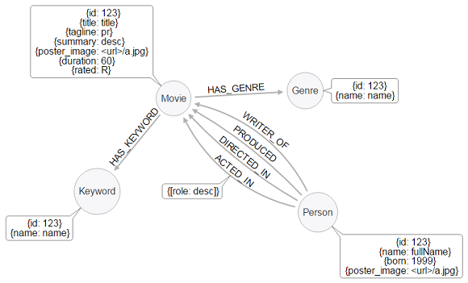
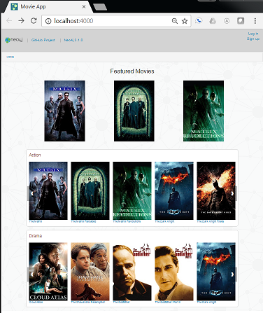

# README

This Neo4j-based example app displays movie and person data in a manner similar to IMDB.
It is designed to serve as a template for further development projects.
There are two versions of the backend - a Python/Flask backend at `/flask-api`, and a JavaScript/Express backend at `/api`. 
The web frontend can be found at `/web`. 
Feel encouraged to fork and update this repo!

## The Model



### Nodes

* `Movie`
* `Person`
* `Genre`

### Relationships

* `(:Person)-[:ACTED_IN {role:"some role"}]->(:Movie)`
* `(:Person)-[:DIRECTED]->(:Movie)`
* `(:Person)-[:WRITER_OF]->(:Movie)`
* `(:Person)-[:PRODUCED]->(:Movie)`
* `(:MOVIE)-[:HAS_GENRE]->(:Genre)`

## Database Setup: Sandbox

Go to https://sandbox.neo4j.com/?usecase=recommendations&ref=movie-app-tutorial, pick "Recommendations", and press play to start the database.

Make sure to edit the file `flask-api/.env` or `api/.env` and update the `MOVIE_DATABASE_USERNAME`, 
`MOVIE_DATABASE_PASSWORD`, and `MOVIE_DATABASE_URL` of your chosen backend to connect to your instance.

## Node API

First, configure your `api/.env` file to point to your database. 

Then, from the root directory of this project:

* `cd api`
* `nvm use`
* `npm install`
* `node app.js` starts the API
* Take a look at the docs at [http://localhost:3000/docs](http://localhost:3000/docs)

## Alternative: Flask API

First, configure your `flask-api/.env` file to point to your database. 

Then, from the root directory of this project:

```
cd flask-api
python3 -m venv venv
source venv/bin/activate
pip3 install -r requirements.txt
export FLASK_APP=app.py
flask run
```

* Take a look at the docs at [http://localhost:5000/docs](http://localhost:5000/docs)

## Frontend

From the root directory of this project, set up and start the frontend with:

* `cd web`
* `nvm use`
* `npm install`
* update `web/.env` file

If you are using the Node API set `REACT_APP_API_BASE_URL` to `http://localhost:3000/api/v0`

If you are using the Flask api then set it to `http://localhost:5000/api/v0`

* `npm start` starts the app on [http://localhost:3000/](http://localhost:3000/)



voilà! IMDB, eat your heart out ;-)

## Ratings and Recommendations

### User-Centric, User-Based Recommendations

Based on my similarity to other users, user `Omar Huffman` might be interested in movies rated highly by users with similar ratings as himself.

```
MATCH (me:User {name:"Omar Huffman"})-[my:RATED]->(m:Movie)
MATCH (other:User)-[their:RATED]->(m)
WHERE me <> other
AND abs(my.rating - their.rating) < 2
WITH other,m
MATCH (other)-[otherRating:RATED]->(movie:Movie)
WHERE movie <> m
WITH avg(otherRating.rating) AS avgRating, movie
RETURN movie
ORDER BY avgRating desc
LIMIT 25
```

## Contributing

### Node.js/Express API

The Express API is located in the `/api` folder.

#### Create Endpoint

The API itself is created using the [Express web framework for Node.js](https://expressjs.com/). The API endpoints are documented using Swagger.

To add a new API endpoint there are 3 steps:

1. Create a new route method in `/api/routes` directory
2. Describe the method with swagger specification inside a JSDoc comment to make it visible in swagger
3. Add the new route method to the list of route methods in `/api/app.js`.

### Flask API

The Flask API is located in the `/flask-api` folder.
The application code is in the `app.py` file.

#### Create Endpoint

The API itself is created using the [Flask-RESTful](http://flask-restful-cn.readthedocs.io/en/0.3.5/) library.
The API endpoints are documented using Swagger.

To add a new API endpoint there are 3 steps:

1. Create a new Flask-RESTful resource class
2. Create an endpoint method including the swagger docs decorator.
3. Add the new resource to the API at the bottom of the file.
