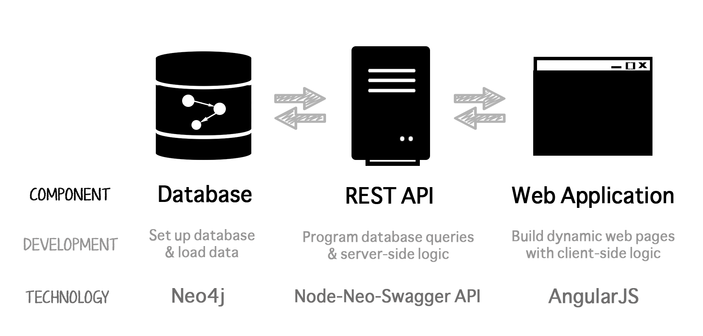

Building a Movie App With Neo4j
======

This tutorial walks through the creation of a complete (full stack) web application, [Neo4j Movies](http://neo4jmovies.herokuapp.com/#/movies), where each step of the stack is explained along the way. It is a Neo4j-Swagger-AngularJS version of [Cineasts.net](https://github.com/spring-projects/spring-data-neo4j/tree/master/spring-data-neo4j-examples/cineasts), a social movie database where users can connect with friends, rate movies, share scores, and generate recommendations for new friends and movies.

The complete source code for the app is available on [GitHub](https://github.com/kbastani/neo4j-movies-template), while resources and references are available at the end of the document. 

# The Web Stack: An Overview



### Database: Neo4j

Written in Java since 2010, [Neo4j](http://neo4j.org/) is a scalable, a fully transactional database (ACID) that stores data structured as graphs. Designed to be intuitive, high performance and scalable, it has a disk-based, native storage manager optimized for storing graph structures. Neo4j can handle graphs with many billions of nodes/relationships/properties on a single machine, but can also be scaled out across multiple machines for high availability.

### REST API: Node-Neo4j-Swagger-API

This application uses a Swagger-compliant API written in [Node.js](http://nodejs.org/), based off the [node-neo4j-swagger-api](https://github.com/tinj/node-neo4j-swagger-api) written by [flipside](https://github.com/flipside).  

### Web Application: AngularJS

_What HTML should have been_, [AngularJS](https://angularjs.org/) is an open-source web application framework. It assists in client-side development of rich web applications that use HTML, CSS and Javascript. Its goal is to augment web applications with model–view–controller (MVC) capability, in an effort to make both development and testing easier. AngularJS' [two-way data binding](https://docs.angularjs.org/guide/databinding) is its most notable feature that simplifies code-writing by relieving the server backend of templating responsibilities. Instead, templates are rendered in plain HTML according to data that is contained in the scope defined in the model.

# The Domain Model

### Neo4j: Background

The Neo4j _property graph_ data model consists of nodes and relationships, both of which can have _key-value_-style properties. What does that mean, exactly? Nodes are the graph-database equivalent for records (in the relational model), with property keys instead of column names. That's normal enough. Relationships are the special part. In Neo4j, relationships are first-class citizens. More than a simple foreign-key reference to another record (node), relationships carry information that allows us to link nodes to form semantically-rich networks:


### The Movie Database 

The data model in this tutorial includes nodes with three different labels (each with their own properties), and six different types of relationships (one of which has its own property). The underlying structure of the database is visualized in the image below:


The Swagger API, which lies between the AngularJS web application and the Neo4j database, exports a relevant subset of the above model like so. You can see the Swagger API in action [here](http://movieapi-neo4j.herokuapp.com/docs/).


# Neo4j: Setting Up the Database Server

### Running Neo4j

To dynamically access the database, start an instance of the server on your local machine:

- If you haven't done so already, [download Neo4j](http://www.neo4j.com/download/)
- Extract Neo4j to a convenient location and rename the folder to something less cumbersome, like 'Neo4j', if you want
- On your Terminal, navigate to the extracted folder with `cd PATH_TO_FOLDER`, and run `./bin/neo4j start`
- If all goes well, you should see the Neo4j web interface running locally at [port 7474](http://localhost:7474/)
  - This built-in browser interface provides a web-UI for users to access the database easily. Learn more about it [here](http://docs.neo4j.org/chunked/stable/tools-webadmin.html)

### Stopping Neo4j

The Neo4j database server runs in the background and should be stopped after each use:

- On your Terminal, navigate to the Neo4j directory
- If you previously ran Neo4j, stop it with `./bin/neo4j stop`
- To make sure you killed it good, check by running `launchctl list | grep neo` and `launchctl remove` any processes that might be listed

### Learning Cypher 

Cypher is an expressive and efficient declarative query language for the graph database, Neo4j (think SQL to relational databases). Although simple Cypher is relatively easy to pick up by osmosis, take a look at the [Learn Cypher](http://www.neo4j.org/learn/cypher) page for a basic introduction to the language. 

### Loading Sample Data into Neo4j

An empty database is not much fun. Let's load some sample _Movie_ data in and see Neo4j in action:

- If you `ls data` in the Neo4j directory, you'll see a file/folder called `graph.db`. It contains stored, persistent data in the database. Delete the existing `graph.db` file/folder

- On a new Terminal window, navigate to the source code folder for this web app (if you already cloned it onto your desktop from [GitHub](https://github.com/kbastani/neo4j-movies-template)). Copy the zipped _Movie_ sample data file into your local Neo4j database with `cp database/graph.db.zip PATH_TO_NEO4J_DATABASE_FOLDER/data`, and unzip it
- Alternatively, if you don't have the cloned repository, download the said file [here](https://github.com/kbastani/neo4j-movies-template/tree/master/database), and unzip it into the `PATH_TO_NEO4J_DATABASE_FOLDER/data` folder

- Run Neo4j as before! You should be able to see some nodes at [port 7474](http://localhost:7474/)


### Loading Your Own Data
Although this tutorial's repository comes with a pre-built _Movie_ `graph.db` file, you'll want to learn how to create a `graph.db` file with your own data set, that is customized to your web application. This section will demonstrate how to import your own data into your local Neo4j instance. Although there are [multiple ways](http://www.neo4j.org/develop/import) to create a `graph.db` from scratch, we will focus on using the Cypher command `LOAD CSV` here. 

_<<< insert new instructions (pending) >>>_
<!-- 
## Building the Database

Although the tutorial repository comes with a pre-built `graph.db` file, you'll need to be able to create your own `graph.db` file with your own data. This section will demonstrate how to re-create the existing `graph.db` file on your local Neo4j instance. Although there are multiple ways to create a `graph.db` from scratch, this tutorial will use the Cypher command `LOAD CSV`. 

### Getting Ready

- Stop Neo4j and move the existing `graph.db` file out of the `data` folder in your instance of Neo4j. When you restart Neo4j, it will detect the absence of this file and generate a blank one. 
- Prepare and organize your data into CSV files. Take a look at the `csv` folder in this repository for the files used to build the movie database. 
	- Each node should have a unique ID
	- Each node type should have its own file. In this example, there are three node types, Genre, Person and Movie, and their data are in `genre_nodes.csv`, `person_nodes.csv` and `movie_nodes.csv`, respectively. 
	- Each relationship type should have its own file. In this example, there are seven relationship types, each represented in their own .csv file
	- Delimiters should not appear in the raw data. Unlike the comma or any other commonly-used punctuation mark, the pipe `|` is a decent choice for delimiter as it is unlikely to appear in the raw data, and a quick search reveals it does not appear in the data. 
	- Headers should be unique within files. As `LOAD CSV` (in this example) uses headers, make sure that each column in a file has a unique header. 
	
### Using LOAD CSV

Data ready, let's fill up the database. Although there are a few methods to get medium amounts of data into a Neo4j database, in this tutorial we'll be using `LOAD CSV`. If you're rusty on Cypher, take a look at [this Graph Gist](http://gist.neo4j.org/?github-whatSocks%2FGG_Movies%2F%2FmoviesGG.adoc) to see `LOAD CSV` in action before you start. 

Since this tutorial assumes you're running Neo4j locally, your csv path might look something like `file:/` + `path from root to csv file/` + `filename.csv`.

Start up Neo4j and head over to `http://localhost:7474/browser/`, or start the [Neo4j shell](http://docs.neo4j.org/chunked/stable/shell-starting.html). Note that although the shell requires semicolons, they are optional in the pretty web console. 

Make sure you're pointing at the correct location with a test query (but write your own path in).  

```
LOAD CSV WITH HEADERS
FROM "file:/Users/cristina/Documents/NT/neo4j-movies-template/csv/nodes/genre_nodes.csv" 
AS line 
FIELDTERMINATOR '|' 
WITH line LIMIT 4
RETURN line;
```
Once you've played around a bit and are sure you know where you're pointing, clear the database of any test data and start importing your data. 

```
//Clear the database of any remnants of test data:
MATCH (n)
WITH n LIMIT 10000
OPTIONAL MATCH (n)-[r]->()
DELETE n,r;
```

#### Import your Nodes

```
LOAD CSV WITH HEADERS
FROM "file:/Users/cristina/Documents/NT/neo4j-movies-template/csv/nodes/genre_nodes.csv" 
AS line 
FIELDTERMINATOR '|'
WITH line
CREATE (g:Genre {id:toInt(line.id), name:line.name});
```

```
LOAD CSV WITH HEADERS
FROM "file:/Users/cristina/Documents/NT/neo4j-movies-template/csv/nodes/person_nodes.csv" 
AS line 
FIELDTERMINATOR '|'
CREATE (p:Person {id:toInt(line.id), name:line.name, poster_image:line.poster_image, born:toInt(line.born)});
```

```
LOAD CSV WITH HEADERS
FROM "file:/Users/cristina/Documents/NT/neo4j-movies-template/csv/nodes/movie_nodes.csv" 
AS line 
FIELDTERMINATOR '|'
CREATE (m:Movie {id:toInt(line.id), title:line.title, poster_image:line.poster_image, born:line.born, tagline:line.tagline, summary:line.summary, released:toInt(line.released), duration:toInt(line.duration), rated:line.rated});
```

```
LOAD CSV WITH HEADERS
FROM "file:/Users/cristina/Documents/NT/neo4j-movies-template/csv/nodes/keyword_nodes.csv" 
AS line 
FIELDTERMINATOR '|'
CREATE (m:Keyword {id:toInt(line.id), name:line.name});
```

#### Import your Relationships:

```
LOAD CSV WITH HEADERS
FROM "file:/Users/cristina/Documents/NT/neo4j-movies-template/csv/rels/acted_in_rels.csv" 
AS line 
FIELDTERMINATOR '|'
MATCH (p:Person {id:toInt(line.person_id)}), (m:Movie {id:toInt(line.movie_id)})
MERGE (p)-[:ACTED_IN {role:line.roles}]->(m);
```

```
LOAD CSV WITH HEADERS
FROM "file:/Users/cristina/Documents/NT/neo4j-movies-template/csv/rels/directed_rels.csv" 
AS line 
FIELDTERMINATOR '|'
MATCH (p:Person {id:toInt(line.person_id)}), (m:Movie {id:toInt(line.movie_id)})
MERGE (p)-[:DIRECTED]->(m);
```

```
LOAD CSV WITH HEADERS
FROM "file:/Users/cristina/Documents/NT/neo4j-movies-template/csv/rels/has_genre_rels.csv" 
AS line 
FIELDTERMINATOR '|'
MATCH (m:Movie {id:toInt(line.movie_id)}), (g:Genre{id:toInt(line.genre_id)})
MERGE (m)-[:HAS_GENRE]->(g);
```

```
LOAD CSV WITH HEADERS
FROM "file:/Users/cristina/Documents/NT/neo4j-movies-template/csv/rels/produced_rels.csv" 
AS line 
FIELDTERMINATOR '|'
MATCH (p:Person {id:toInt(line.person_id)}), (m:Movie {id:toInt(line.movie_id)})
MERGE (p)-[:PRODUCED]->(m);
```

```
LOAD CSV WITH HEADERS
FROM "file:/Users/cristina/Documents/NT/neo4j-movies-template/csv/rels/writer_of_rels.csv" 
AS line 
FIELDTERMINATOR '|'
MATCH (p:Person {id:toInt(line.person_id)}), (m:Movie {id:toInt(line.movie_id)})
MERGE (p)-[:WRITER_OF]->(m);
```

```
LOAD CSV WITH HEADERS
FROM "file:/Users/cristina/Documents/NT/neo4j-movies-template/csv/rels/has_keyword_rels.csv" 
AS line 
FIELDTERMINATOR '|'
MATCH (m:Movie {id:toInt(line.movie_id)}), (k:Keyword {id:toInt(line.keyword_id)})
MERGE (m)-[:HAS_KEYWORD]->(k);
```
-->

### Testing Data Import: _This to That_

Naturally you'd want to see if you've imported your data correctly. Run the _This to That_ query on the Neo4j browser:

```
MATCH (a)-[r]->(b)
WHERE labels(a) <> [] AND labels(b) <> []
RETURN DISTINCT head(labels(a)) AS This, type(r) as To, head(labels(b)) AS That
LIMIT 10;
```
It returns the schema of this data set, specifically, how different node types are related to one another. You should get a result that looks something like:

```
This	To			That
Person	ACTED_IN	Movie
Person	DIRECTED	Movie
Person	PRODUCED	Movie
Person	WRITER_OF	Movie
Person	REVIEWED	Movie
Movie	HAS_GENRE	Genre
``` 


# Node-Neo4j-Swagger API: Querying Database

### Background

The Node-Neo4j-Swagger API was written to make it as easy as possible to create an API using Node.js and Neo4j that can be consumed by some other app. Swagger provides interactive documentation so that it is easy to interact with the API. Node-Neo4j-Swagger merges the Swagger with Neo4j queries and visualizations so developers can see how Neo4j and the API results relate to each other.

### From Routes to Models

Let's take a look at how thoughts are organized in the Swagger part of this application, which lives in the `api` folder:


Let's start at `app.js` (assuming we're in `api`). `app.js` starting the machinery of the app, and (importantly if you want to add your own models), and pulls the list of models from `routes/index.js`, which looks something like:

```
// convenience wrapper around all other files:
exports.site = require('./site');
exports.people = require('./people');
exports.movies = require('./movies');
exports.genres = require('./genres');
```

Let's take a look at the `api/routes/genres.js`:

```
// genres.js

var Genres = require('../models/genres');

// ...  important stuff commented out here 

/*
 *  Util Functions
 */

// ...  more important stuff commented out here 


/*
 * API Specs and Functions
 */

exports.list = {
  'spec': {
    "description" : "List all genres",
    "path" : "/genres",
    "notes" : "Returns all genres",
    "summary" : "Find all genres",
    "method": "GET",
    "params" : [],
    "responseClass" : "List[Genre]",
    "errorResponses" : [swe.notFound('genre')],
    "nickname" : "getGenre"
  },
  'action': function (req, res) {
    // var friends = parseBool(req, 'friends');
    var options = {
      neo4j: parseBool(req, 'neo4j')
    };
    var start = new Date();

      Genres.getAll(null, options, function (err, response) {
        if (err || !response.results) throw swe.notFound('genres');
        writeResponse(res, response, start);
      });
  }
};
```

We can assume from this code snipped that the Swagger API has at least one endpoint of flavor `GET` that presumably returns 'all' the genres in the database. 

More evidence is found in `app.js`, where we see the `list` method in action:

```
// Add models and methods to swagger
swagger.addModels(models)
.addGet(routes.genres.list)
```
But how does the app know what data to send? Who fills this endpoint with delicious `getAll` data? `var Genres = require('../models/genres');` in `api/routes/genres.js` is a pretty good hint. Let's take a look:

```
/**
 *  neo4j genre functions
 *  these are mostly written in a functional style
 */

var Genre = require('../models/neo4j/genre');

// ...  important stuff commented out here 

/**
 *  Result Functions
 *  to be combined with queries using _.partial()
 */

// ...  important result functions commented out here 

// return many genres
var _manyGenres = function (results, callback) {
  var genres = _.map(results, function (result) {
    return new Genre(result.genre);
  });

  callback(null, genres);
};

/**
 *  Query Functions
 *  to be combined with result functions using _.partial()
 */

// ... other query functions here 

var _matchBy = function (keys, params, options, callback) {
  var cypher_params = _.pick(params, keys);

  var query = [
    'MATCH (genre:Genre)',
    Cypher.where('genre', keys),
    'RETURN genre'
  ].join('\n');

  callback(null, query, cypher_params);
};

var _matchAll = _.partial(_matchBy, []);

// get all genres
var getAll = Cypher(_matchAll, _manyGenres);

// export exposed functions

module.exports = {
  getAll: getAll
};
```

In short, `getAll` is built out of the `_matchAll` and `_manyGenres` partials. `_matchAll`, a query function, calls `_matchBy`, who presents a Cypher query to the server. `_manyGenres`, a result function, organizes the data. `getAll` is packaged into a module and exported for easy consumption. 

Take note that this query can literally only export Genre nodes. If you want to export something else, you'll have to edit or write a new result function (currently, `manyGenres`). 

Try using something like this, assuming you've wrapped your associated query in something called `breakdown`:

```
// return multiple Test Items
var _manyBreakdown = function (results, callback) {
  console.log(results[0]) //use this to tweak 
  if (results.length) {
    var output = _.map(results, function (result) {
      return results[0].breakdown
    });
    callback(null,output);
  } else {
    callback(null, null);
  }
};
``` 

Test Cypher query:

```
var _getTest = function (params, options, callback) {
  var cypher_params = {};

  var query = [
    'RETURN {cat:23, bob:45, amazing:"tomato"} AS breakdown;'
  ].join('\n');

  callback(null, query, cypher_params);
};

```


# AngularJS: Building Dynamic Web Pages

Now that the database is ready and endpoints set up, you'll probably want a nice front-end to display your data. Because what is a website other than a human-friendly way to explore a database? 

Without going too deep into AngularJS design patterns, let's take a look at the construction of the Movie item, or, basically, that stuff you see when you click on a movie poster. 

```
// this is in web/dist/assets/js/controller.js

contentApp.controller('MovieItemCtrl', ['$scope', '$routeParams', '$http', '$templateCache',
  function($scope, $routeParams, $http, $templateCache) {
  		console.log('http://movieapi-neo4j.herokuapp.com/api/v0/movies/title/' + 
  				encodeURIComponent(decodeURI(decodeURI($routeParams.movieId))) + 
  				'?api_key=special-key&neo4j=false');
  		$scope.url = 'http://movieapi-neo4j.herokuapp.com/api/v0/movies/title/' + 
  				encodeURIComponent(decodeURI(decodeURI($routeParams.movieId))) + 
  				'?api_key=special-key&neo4j=false';
	  	var fetchMovie = function()
	  	{
	  		$http({method: 'GET', url: $scope.url, cache: $templateCache}).
			    success(function(data, status, headers, config) {
			    	$scope.movie = data;
			    	$scope.movie.poster_image = $scope.movie.poster_image || '/assets/img/posters/' +
			    		$scope.movie.title.replace('/', ' ')  + '.jpg';
			    	$scope.movie.poster_image = $scope.movie.poster_image.replace("w185", "w300");
			    }).
			    error(function(data, status, headers, config) {
			    // called asynchronously if an error occurs
			    // or server returns response with an error status.
			    });
	  	}

	  	fetchMovie();
  }]);
  
```

Take a look at the	`$scope.url`:


```
$scope.url = 'http://movieapi-neo4j.herokuapp.com/api/v0/movies/title/' + 
  				encodeURIComponent(decodeURI(decodeURI($routeParams.movieId))) + 
  				'?api_key=special-key&neo4j=false';
```

Here you can see the web user interface grabbing information from the NodeJS API. When a Movie is fetched, this AngularJS machine GETs the Movie-related JSON and uses it to build the Movie item view. 

You can see these items populate `web\dist\item.html` through `<body ng-controller="MovieItemCtrl">`.

# References

## Neo4j

- [LOAD CSV into Neo4j Quickly and Successfully
](https://gist.github.com/jexp/d788e117129c3730a042)
- [Using LOAD CSV to Import Git History into Neo4j](http://jexp.de/blog/2014/06/using-load-csv-to-import-git-history-into-neo4j/)
- [Movies GraphGist](http://gist.neo4j.org/?github-whatSocks%2FGG_Movies%2F%2FmoviesGG.adoc)
- [Using Index Hints](http://docs.neo4j.org/chunked/milestone/query-using.html)

## Swagger

- [The Swagger Spec](https://github.com/wordnik/swagger-spec)

## AngularJS
